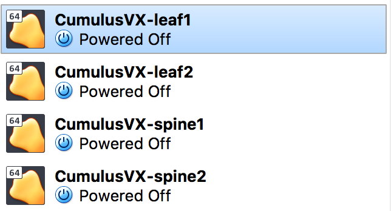

# 1 Network Topology

This article assumes that you are configuring a two-leaf/two-spine network topology like this:


# 2 Download Cumulus VX Image

https://cumulusnetworks.com/products/cumulus-vx/download/

Here VirtualBox is used.

# 3 Create a Cumulus VX VM with VirtualBox

- Open VirtualBox and click File > Import Appliance.
- Browse for the downloaded VirtualBox image, click the Open button, then click Continue.
- Review the Appliance settings. Change the name of the VM to CumulusVX-leaf1, then click Import to begin the import process.
- Right click the created CumulusVX-leaf1 VM, then select Clone.
- Change the name of the VM to CumulusVX-leaf2, then click Continue. Select Full Clone and click Clone.
- Repeat clone steps to create two additional VMs:
- CumulusVX-spine1 and CumulusVX-spine2.
- After this step you will have 4 VMs:



# 4 FRR Daemon Configuration

Do it on all 4 VMs.

Cumulus VX login:

- username: cumulus
- password: CumulusLinux!

```
sudo edit `/etc/frr/daemons
```

Set:

```
zebra=yes
bgpd=yes
ospfd=yes
```

# 5 Network interfaces Configuration

Edit `/etc/network/interfaces` for the 4 VMs:

CumulusVX-leaf1:

```
# The loopback network interface
auto lo
  iface lo inet loopback
  address 10.2.1.1/32
  
# The primary network interface
auto eth0
  iface eth0 inet dhcp
  
auto swp1
  iface swp1
  address 10.2.1.1/32
  
auto swp2
  iface swp2
  address 10.2.1.1/32
  
auto swp3
  iface swp3
  address 10.4.1.1/24
```

CumulusVX-leaf2:

```
# The loopback network interface
auto lo
  iface lo inet loopback
  address 10.2.1.2/32
  
# The primary network interface
auto eth0
  iface eth0 inet dhcp
  
auto swp1
  iface swp1
  address 10.2.1.2/32
  
auto swp2
  iface swp2
  address 10.2.1.2/32
  
auto swp3
  iface swp3
  address 10.4.2.1/24
```

CumulusVX-spine1:

```
# The loopback network interface
auto lo
  iface lo inet loopback
  address 10.2.1.3/32
  
# The primary network interface
auto eth0
  iface eth0 inet dhcp
  
auto swp1
  iface swp1
  address 10.2.1.3/32
  
auto swp2
  iface swp2
  address 10.2.1.3/32
  
auto swp3
  iface swp3
```

CumulusVX-spine2:

```
# The loopback network interface
auto lo
  iface lo inet loopback
  address 10.2.1.4/32
  
# The primary network interface
auto eth0
  iface eth0 inet dhcp
  
auto swp1
  iface swp1
  address 10.2.1.4/32
  
auto swp2
  iface swp2
  address 10.2.1.4/32
  
auto swp3
  iface swp3
```

# 6 FRR Configuration

Edit `/etc/frr/frr.conf` for the 4 VMs:

CumulusVX-leaf1:

```
service integrated-vtysh-config
  
interface swp1
  ip ospf network point-to-point
  
interface swp2
  ip ospf network point-to-point
  
router-id 10.2.1.1
  
router ospf
  ospf router-id 10.2.1.1
  network 10.2.1.1/32 area 0.0.0.0
  network 10.4.1.0/24 area 0.0.0.0
```

CumulusVX-leaf2:

```
service integrated-vtysh-config
  
interface swp1
  ip ospf network point-to-point
  
interface swp2
  ip ospf network point-to-point
  
router-id 10.2.1.2
  
router ospf
  ospf router-id 10.2.1.2                                                         
  network 10.2.1.2/32 area 0.0.0.0
  network 10.4.2.0/24 area 0.0.0.0
```

CumulusVX-spine1:

```
service integrated-vtysh-config
  
interface swp1
  ip ospf network point-to-point
  
interface swp2
  ip ospf network point-to-point
  
router-id 10.2.1.3
  
router ospf
  ospf router-id 10.2.1.3
  network 10.2.1.3/32 area 0.0.0.0
```

CumulusVX-spine2:

```
service integrated-vtysh-config
  
interface swp1
  ip ospf network point-to-point
  
interface swp2
  ip ospf network point-to-point
  
router-id 10.2.1.4
  
router ospf
  ospf router-id 10.2.1.4
  network 10.2.1.4/32 area 0.0.0.0
```

# 7 Restart Services

On all hosts:

```
sudo systemctl restart networking
sudo systemctl restart frr.service
```

# 8 VirtualBox Network Configuraiton

You need to configure the network adapter settings for each VM to create point-to-point connections.

Shutdown all hosts.

In VirtualBox, Adapter 1 is NAT used for accessing public internet, we here configure Adapter 2, 3, and maybe 4:

- In the VirtualBox Manager window, select the VM.
- Click Settings, then click Network.
- Click Adapter 2, 3, and 4
- Click the Enable Network Adapter check box.
- From the Attached to list, select Internal Network.

Set names according to:


The network names can be different, the thing is to configure same name between spine1 swp1 and leaf1 swp1, spine1 swp2 and leaf2 swp1, etc.

Example:

```
CumulusVX-leaf1	 	Adapter 1	NAT	 
 	swp1	Adapter 2	Internal	Intnet-1
 	swp2	Adapter 3	Internal	Intnet-3
 	swp3	Adapter 4	Internal	Intnet-5
CumulusVX-leaf2	 	Adapter 1	NAT	 
 	swp1	Adapter 2	Internal	Intnet-2
 	swp2	Adapter 3	Internal	Intnet-4
 	swp3	Adapter 4	Internal	Intnet-6
CumulusVX-spine1	 	Adapter 1	NAT	 
 	swp1	Adapter 2	Internal	Intnet-1
 	swp2	Adapter 3	Internal	Intnet-2
 	swp3	Adapter 4 (disabled)
CumulusVX-spine2	 	Adapter 1	NAT	 
 	swp1	Adapter 2	Internal	Intnet-3
 	swp2	Adapter 3	Internal	Intnet-4
 	swp3	Adapter 4 (disabled)
```
 	 
# 9 Test

On leaf1:

Ping CumulusVX-leaf2:

```
cumulus@CumulusVX-leaf1:~$ ping 10.2.1.2
```

Ping CumulusVX-spine1:

```
cumulus@CumulusVX-leaf1:~$ ping 10.2.1.3
```

Ping CumulusVX-spine2:

```
cumulus@CumulusVX-leaf1:~$ ping 10.2.1.4
```

Can also do the test on other hosts.
